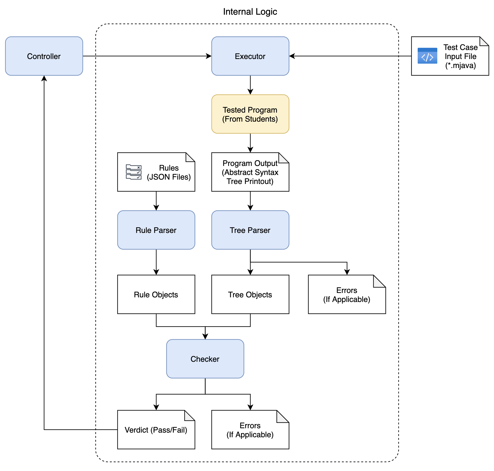

# SYSU DCS290 Project 2 Judge Program

This is a simple program that checks whether there are any 
mistakes in students' project 2 homework submission, and 
gives either a "pass" or an "fail" result for each test 
case. If you have any question, contact me by email.

Note: tests can be unsound. A "pass" result does not 
guarantee the correctness of the tested program.

### Requirements
- Python 3.9+
- Linux/Unix system (untested on Windows)

### Usage

```
cd dcs290-proj2-judge
python src/judge.py <tested_program_path>
```

Note: Your working directory must be `dcs290-proj2-judge` 
rather than `dcs290-proj2-judge/src`.

### How it works?

This judge program is consisted of five components:
- A controller (`src/judge.py`)
- An executor (`src/internal/executor.py`)
- A checker (`src/internal/checker.py`)
- A tree parser (`src/internal/tree_parser.py`)
- A rule parser (`src/internal/rule_parser.py`)



The executor runs the tested program from students, feeding 
it with *.mjava files as input and collect its outputs 
(syntax tree printout). The tree parser accepts this printout 
and parse it into tree objects. The rule parser provides some 
rules specified by JSON files. Then, the checker checks whether 
the shape of the tree conforms to the rules, and gives a 
verdict.

There are six types of rules:
- `$exist X` asserts a tree node `X` exists
- `$child X Y` asserts a tree node `Y` is a child of another
  tree node `X` (it does not have to be the direct child; it can 
  be a grandchild, a great grandchild, ... The same below)
- `$left X Y` asserts a tree node `Y` is in the left subtree of 
  another node `X`
- `$right X Y` asserts a tree node `Y` is in the right subtree 
  of another node `X`
- `$parentLeft X Y` asserts a tree node `Y` is in the left 
  subtree of the parent of another node `X`
- `$parentRight X Y` asserts a tree node `Y` is in the right 
  subtree of the parent of another node `X`

For details, please refer to `rules/example.json`.

### License
The MIT License

Copyright (c) 2021 Ziyan Wang

